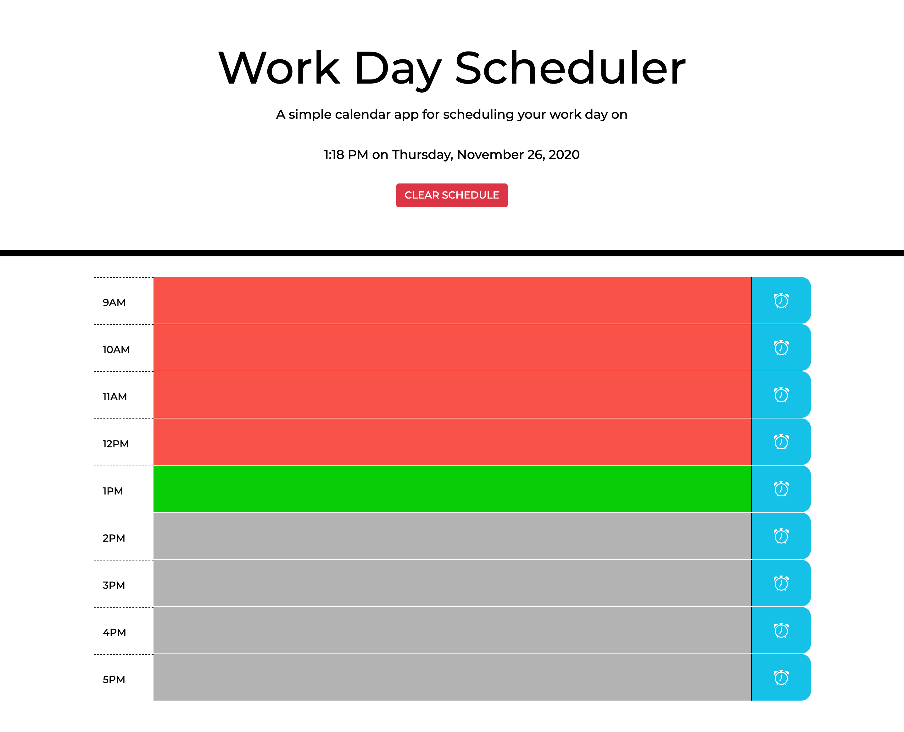

# Work Day Scheduler

## Purpose
Allows users to create and save a schedule for a standard 9AM to 5PM work day.

## Contents
1. [Features](#features)
2. [Built With](#built-with)
3. [Web Page Mockup](#web-page-mockup)
4. [Contribution](#contribution)

## Features
* Current time updates every minute.
* Tasks are added to the schedule by clicking on the time block.
* Clicking on the save button will save user's tasks in local storage.
* Time blocks are color-coordinated according to past, present, or future hours.
* "CLEAR SCHEDULE" button clears all tasks, allowing users to easily start a new day.

## Built With
* HTML5
* JavaScript
* JQuery 
* CSS3
* BootStrap 4
* Moment.js

## Web Page Mockup

[Deployed Application](valiantcreative33.github.io/work-day-scheduler/)

## Contribution
* Starter code provided by [UCF Coding Boot Camp](https://github.com/coding-boot-camp/super-disco).
* Everything else was built with lots of confusion and caffeine by Ruben Matamoros.